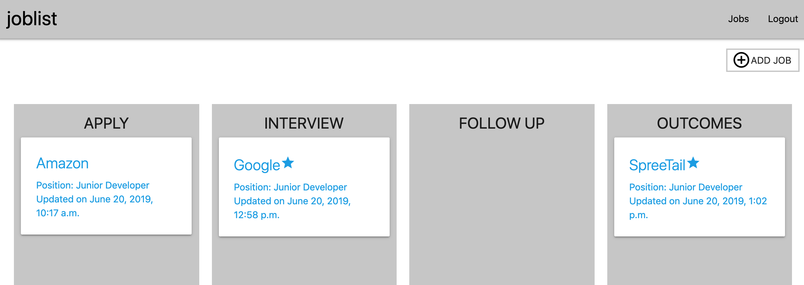
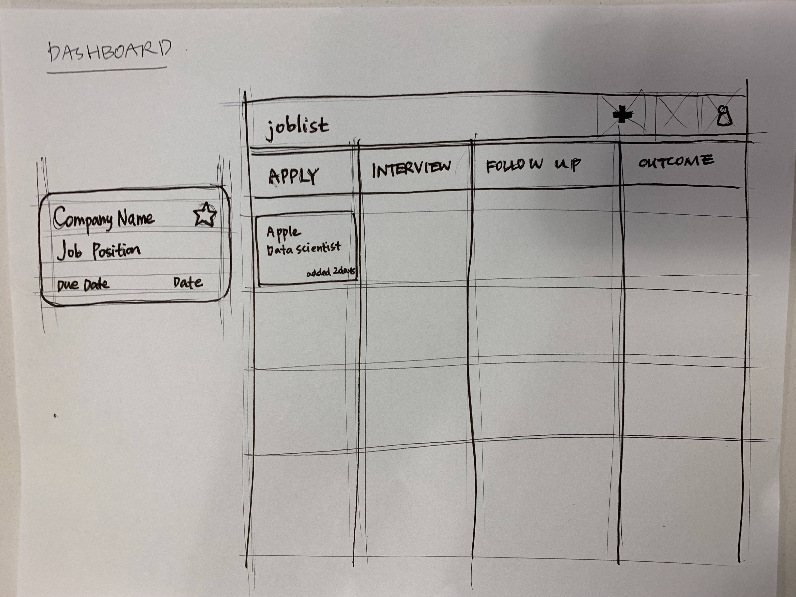
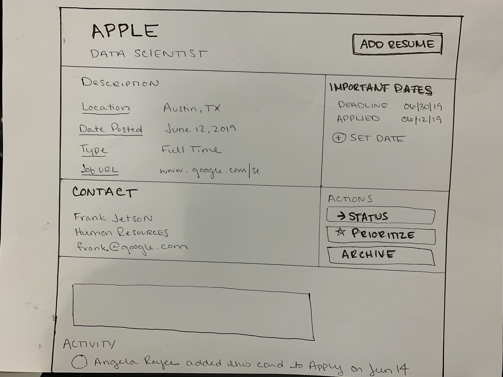
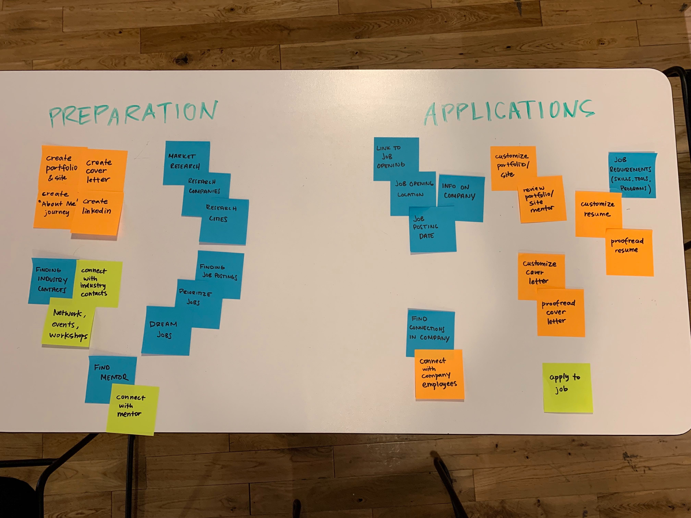
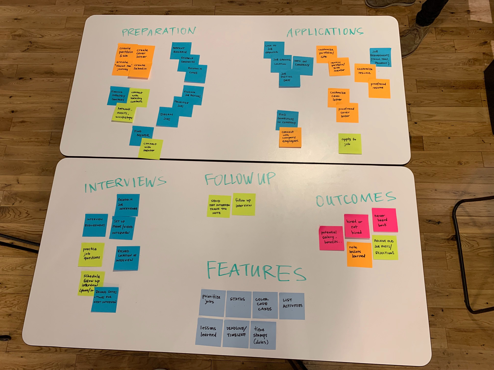
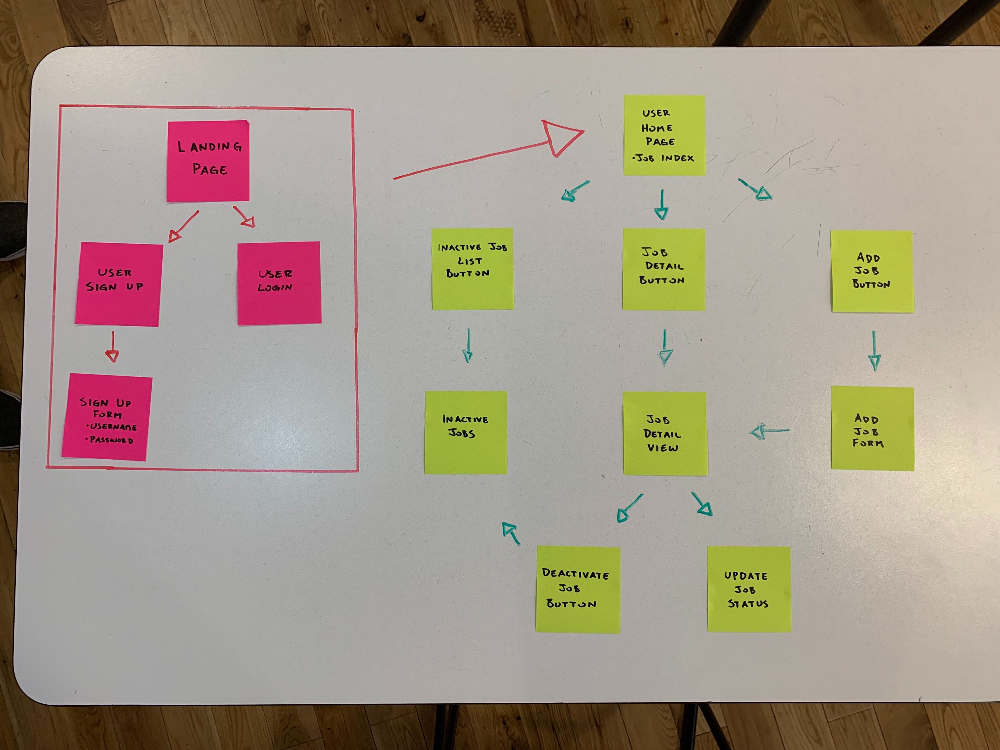

# JobTracker
## Description
### JobTracker allows users to keep track of every aspect of the job search process.  Users will be able to move a job card between four different stages: Apply, Interview, Follow Up, and Outcomes so they always know what needs to be done for each job they've applied for.

## Technologies Used
#### - Django
#### - Python
#### - Postgresql
#### - HTML
#### - CSS / Materialize

## Pitch Deck
https://docs.google.com/presentation/d/1kc3XvsIeVzgbIlXtt-nUMDHYFu5P5O9xVpGlfyfNI_g/edit#slide=id.p

## Trello
https://trello.com/b/HsiUm86k/jobtracker

## Wireframes and User Flow

## Heroku
https://hidden-sands-65631.herokuapp.com/

## Future Goals
#### -Add Board Feature
#### -More Styling
#### -Archive Feature
#### -Task Tracker Checklist
